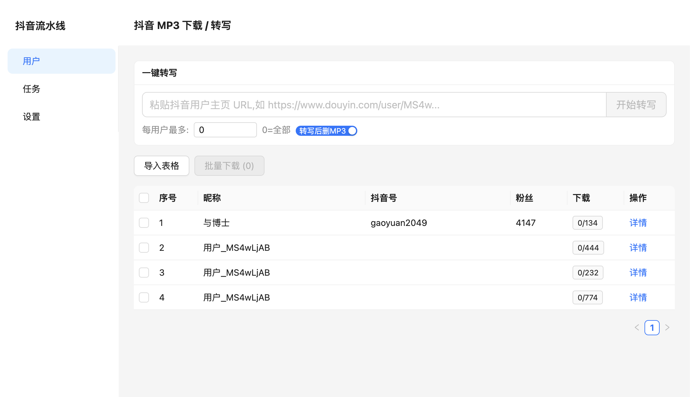
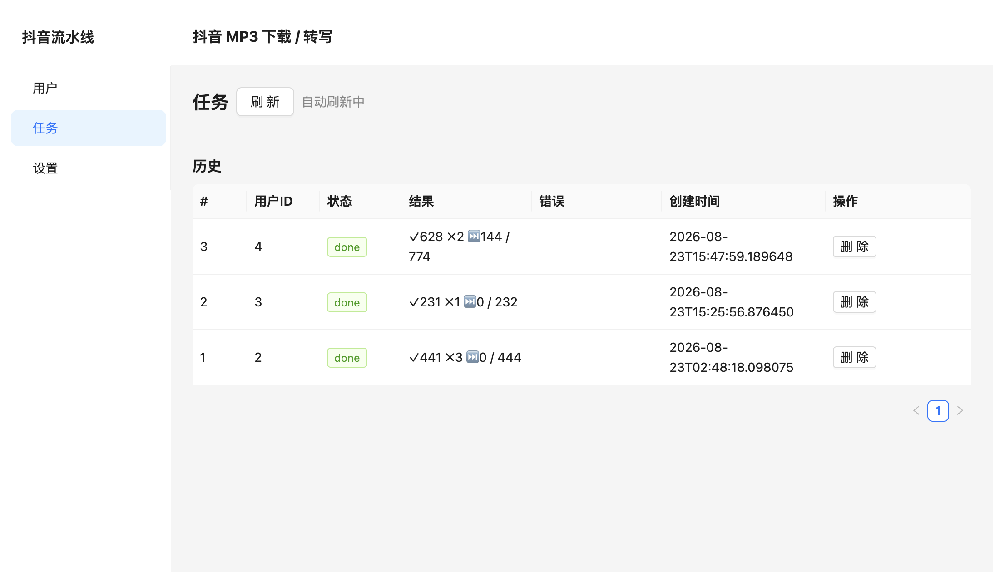
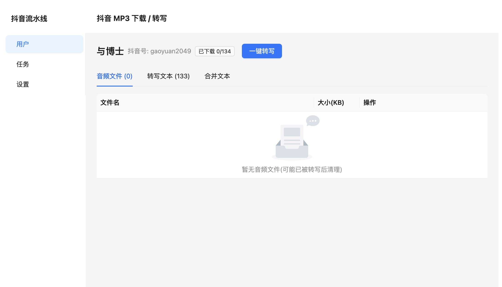
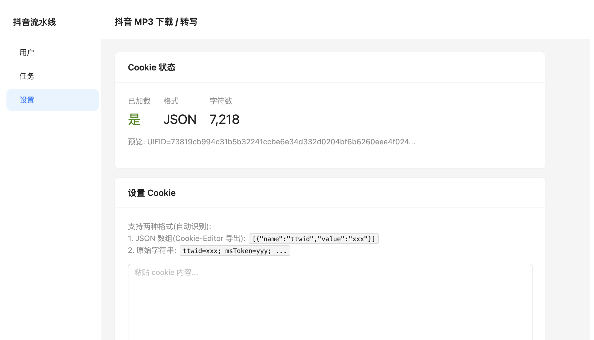
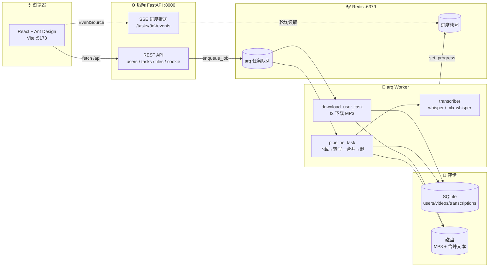
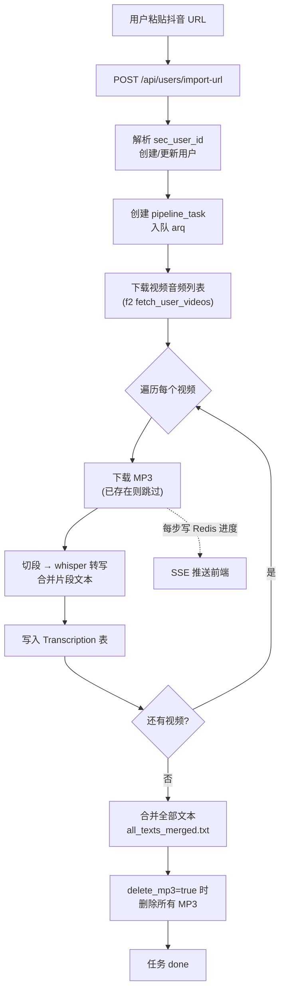
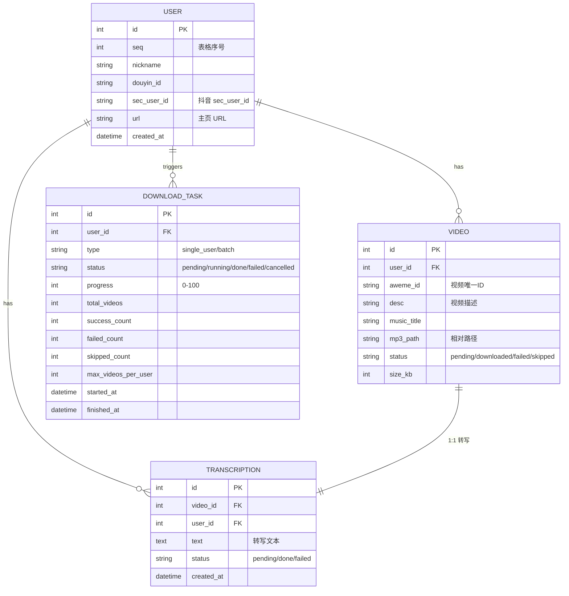
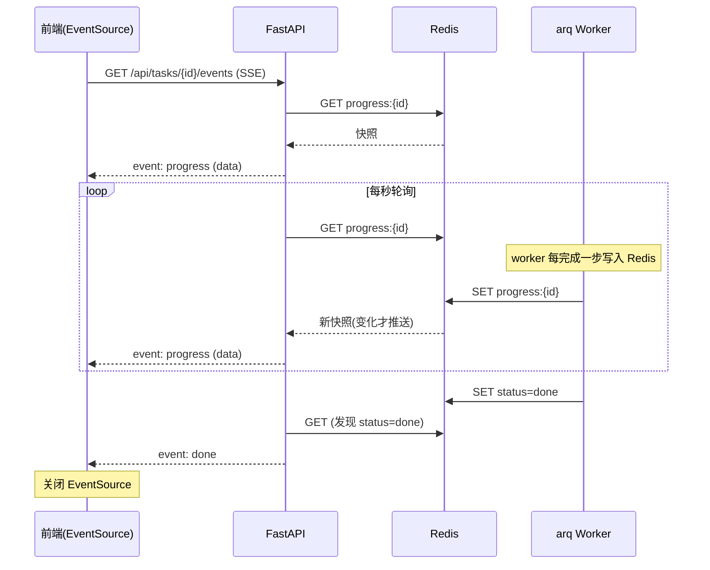

# 抖音音频下载与语音转写流水线

> 一键把抖音用户主页变成可检索的文本语料:粘贴一个用户链接,系统自动下载视频音频 → 语音转写 → 合并文本 → 清理临时 MP3,全程可视化进度,前端实时展示。

一套**前后端分离**的本地优先(Python + React)应用,把原命令行脚本「下载 → 转写 → 合并」三步管线 Web 化,通过任务队列异步执行、SSE 推送实时进度,Apple Silicon 上用 `mlx-whisper` 加速转写。

---

## 目录

- [✨ 功能特性](#-功能特性)
- [🖼️ 界面预览](#-界面预览)
- [🏗️ 架构设计](#-架构设计)
- [🔁 工作流程](#-工作流程)
- [🗂️ 目录结构](#-目录结构)
- [🚀 快速开始](#-快速开始)
- [⚙️ 配置说明](#-配置说明)
- [📡 API 文档](#-api-文档)
- [🧰 运维脚本](#-运维脚本)
- [🛠️ 技术栈](#-技术栈)
- [❓ 常见问题](#-常见问题)

---

## ✨ 功能特性

- **URL 一键转写** —— 粘贴抖音用户主页链接,自动完成「解析 sec_user_id → 建用户 → 下载音频 → 转写 → 合并 → 删 MP3」全流程。
- **批量下载管理** —— 支持表格批量导入用户,勾选后批量下载,每用户可设视频上限。
- **语音转写引擎** —— 集成 OpenAI `whisper` 与 Apple `mlx-whisper`,自动按需切段(默认 120s),转写后合并为单条文本。
- **实时进度推送** —— 任务页通过 SSE(Server-Sent Events)实时刷新进度条与当前处理项。
- **音频文件管理** —— 用户详情页可在线试听、下载、定向删除 MP3。
- **合并文本查看** —— 一键查看用户全部转写合并后的长文本,可直接复制取用。
- **任务生命周期管理** —— 进行中任务可「取消」,已结束任务可「删除」,卡死任务可一键清理。
- **断点续传** —— 已下载的 MP3 自动跳过,中断后重跑不重复下载。
- **MP3 自动清理** —— 转写合并完成后自动删除 MP3,只保留文本,节省磁盘。

---

## 🖼️ 界面预览

### 用户列表页(首页)

顶部「一键转写」卡片粘贴抖音 URL 即可启动流水线;下方表格管理所有已导入用户,支持批量下载与删除。



### 任务页

「进行中」卡片实时显示进度条与当前处理项;「历史」表格列出全部任务,每行可取消(进行中)或删除(已结束)。



### 用户详情页

三个标签页:**音频文件**(试听/下载/删除)、**转写文本**(逐条查看)、**合并文本**(全文复制)。顶部「一键转写」可针对该用户单独启动流水线。



### 设置页

配置抖音 Cookie(下载必需),实时显示 Cookie 状态与提示。



---

## 🏗️ 架构设计



**分层职责**

| 层 | 职责 | 关键技术 |
|---|---|---|
| 前端 | UI 渲染、状态管理、SSE 订阅 | React 18 + TanStack Query + Ant Design 5 |
| API 层 | RESTful 接口、SSE 推送、参数校验 | FastAPI + Pydantic |
| 队列层 | 任务调度、进度快照 | Redis + arq |
| Worker 层 | 下载、转写、合并、清理 | f2 + whisper + mlx-whisper |
| 存储层 | 元数据与文本持久化 | SQLAlchemy + SQLite |

---

## 🔁 工作流程

### Pipeline 一键转写全流程



### 数据模型(ER 图)



### SSE 进度推送时序



---

## 🗂️ 目录结构

```
douyin/
├── start.sh                    # 一键启动所有服务
├── stop.sh                     # 一键停止所有服务
├── README.md
├── docs/
│   └── images/                 # README 截图
├── backend/                    # FastAPI 后端
│   ├── app/
│   │   ├── main.py             # 应用入口 + CORS + 路由注册
│   │   ├── config.py           # 配置(路径/Redis/Cookie)
│   │   ├── db.py               # SQLAlchemy engine + session
│   │   ├── models.py           # User/Video/Transcription/DownloadTask
│   │   ├── schemas.py          # Pydantic 请求/响应模型
│   │   ├── api/                # REST 路由
│   │   │   ├── users.py        # 用户管理 + URL导入 + 转写查询
│   │   │   ├── tasks.py        # 任务管理 + SSE + 取消/删除
│   │   │   ├── files.py        # MP3 文件下载/删除
│   │   │   └── cookie.py       # Cookie 状态/保存
│   │   ├── services/           # 业务服务
│   │   │   ├── downloader.py   # f2 下载封装
│   │   │   ├── transcriber.py   # whisper 转写封装
│   │   │   └── cookie.py
│   │   └── workers/            # arq 任务
│   │       ├── arq_app.py     # WorkerSettings 注册
│   │       ├── arq_client.py  # 入队客户端
│   │       ├── tasks.py        # download_user_task / pipeline_task
│   │       └── progress.py    # Redis 进度快照读写
│   ├── alembic/                # 数据库迁移(可选)
│   ├── data/                   # 运行时数据(SQLite + MP3 + 文本)
│   └── pyproject.toml
└── frontend/                   # React 前端
    ├── src/
    │   ├── main.tsx
    │   ├── App.tsx              # 路由 + 布局
    │   ├── api/
    │   │   ├── client.ts       # fetch 封装
    │   │   └── types.ts        # 响应类型
    │   ├── hooks/
    │   │   └── useTaskProgress.ts  # SSE 进度 hook
    │   └── pages/
    │       ├── UsersPage.tsx       # 用户列表 + URL导入
    │       ├── UserDetailPage.tsx  # 用户详情(音频/转写/合并)
    │       ├── TasksPage.tsx       # 任务列表 + 取消/删除
    │       └── SettingsPage.tsx    # Cookie 设置
    ├── vite.config.ts          # Vite + proxy /api → :8000
    └── package.json
```

---

## 🚀 快速开始

### 1. 前置依赖

| 依赖 | 版本 | 安装(macOS) |
|---|---|---|
| Homebrew | 最新 | `/bin/bash -c "$(curl -fsSL https://raw.githubusercontent.com/Homebrew/install/HEAD/install.sh)"` |
| Python | 3.12+ | `brew install python@3.12` |
| Node.js | 18+ | `brew install node` |
| pnpm | 8+ | `brew install pnpm` 或 `npm i -g pnpm` |
| Redis | 7+ | `brew install redis` |
| ffmpeg | 最新 | `brew install ffmpeg` |
| uv | 最新 | `brew install uv` |

### 2. 克隆并启动

```bash
git clone <your-repo-url> douyin
cd douyin

# 一键启动(后台模式,立即返回)
./start.sh

# 或前台模式(阻塞,适合调试/容器)
./start.sh --foreground
```

`start.sh` 会自动:
- 启动 Redis(`:6379`)
- 启动 FastAPI(`:8000`)
- 启动 arq worker
- 启动 Vite 前端(`:5173`)
- 已运行的服务自动跳过

### 3. 访问应用

| 地址 | 说明 |
|---|---|
| http://localhost:5173 | 前端界面 |
| http://127.0.0.1:8000/docs | OpenAPI 交互文档 |
| http://127.0.0.1:8000/ | 后端健康检查 |

### 4. 首次使用

1. 打开 http://localhost:5173 → **设置**页 → 粘贴抖音 Cookie → 保存
2. **用户**页 → 顶部「一键转写」卡片粘贴抖音用户主页 URL → 设置每用户视频上限 → 勾选「转写后删 MP3」→ 点击「开始转写」
3. 自动跳转 **任务**页,实时查看进度
4. 完成后回 **用户**页 → 点「详情」→ **合并文本**标签页查看全文

> 💡 抖音 Cookie 获取:浏览器登录抖音创作者中心,F12 → Application → Cookies → 复制全部 cookie 字符串。

---

## ⚙️ 配置说明

后端配置在 `backend/.env`(可选,不建则用默认值),环境变量前缀 `DOUYIN_`:

```bash
# backend/.env
DOUYIN_REDIS_URL=redis://127.0.0.1:6379/0
DOUYIN_FRONTEND_ORIGIN=http://localhost:5173
```

数据库默认 `backend/data/douyin.db`,MP3 输出 `backend/data/douyin_mp3_output/`,应用启动时自动建表。

---

## 📡 API 文档

完整接口见 http://127.0.0.1:8000/docs ,核心端点:

### 用户

| 方法 | 路径 | 说明 |
|---|---|---|
| `POST` | `/api/users/parse-table` | 从 markdown 表格批量导入用户 |
| `GET` | `/api/users` | 列出全部用户 |
| `GET` | `/api/users/{id}` | 用户详情 |
| `DELETE` | `/api/users/{id}` | 删除用户 |
| `POST` | `/api/users/import-url` | **抖音 URL 一键导入并启动 pipeline** |
| `GET` | `/api/users/{id}/files` | 用户的 MP3 文件列表 |
| `GET` | `/api/users/{id}/transcriptions` | 用户的转写记录列表 |
| `GET` | `/api/users/{id}/merged-text` | 用户的合并文本 |

### 任务

| 方法 | 路径 | 说明 |
|---|---|---|
| `POST` | `/api/tasks/download` | 创建下载任务(批量) |
| `POST` | `/api/tasks/pipeline` | 创建转写流水线任务 |
| `GET` | `/api/tasks` | 任务列表 |
| `GET` | `/api/tasks/{id}` | 任务详情 |
| `POST` | `/api/tasks/{id}/cancel` | 取消进行中任务 |
| `DELETE` | `/api/tasks/{id}` | 删除已结束任务 |
| `GET` | `/api/tasks/{id}/events` | **SSE 实时进度流** |

### 文件 / Cookie

| 方法 | 路径 | 说明 |
|---|---|---|
| `GET` | `/api/files/{video_id}` | 下载/流式播放 MP3 |
| `DELETE` | `/api/files/{video_id}` | 删除 MP3 |
| `GET` | `/api/cookie/status` | Cookie 状态 |
| `POST` | `/api/cookie` | 保存 Cookie |

**示例:URL 一键转写**

```bash
curl -X POST http://127.0.0.1:8000/api/users/import-url \
  -H "Content-Type: application/json" \
  -d '{
    "url": "https://www.douyin.com/user/MS4wLjAB...",
    "auto_pipeline": true,
    "max_videos_per_user": 5,
    "delete_mp3": true,
    "language": "zh",
    "model_name": "base"
  }'
```

---

## 🧰 运维脚本

### `start.sh` —— 启动

```bash
./start.sh                # 后台启动,立即返回(终端友好)
./start.sh --foreground   # 前台阻塞,等待子进程(容器/调试)
./start.sh -f             # 同上简写
```

- 自动启动 Redis / FastAPI / arq / Vite 四个服务
- 已运行的服务自动跳过,不重复启动
- 日志写入 `.logs/`(uvicorn.log / arq.log / vite.log)
- PID 写入 `.logs/*.pid` 供 stop.sh 精确停止

### `stop.sh` —— 停止

```bash
./stop.sh                 # 停止 Vite/arq/FastAPI,保留 Redis
./stop.sh --with-redis    # 连 Redis 一起停
./stop.sh --all           # 同上
```

- 按 PID 文件精确停止,`pkill -f` 兜底(PID 丢失也能停)
- 默认保留 Redis(其他项目可能依赖)

---

## 🛠️ 技术栈

### 后端

| 技术 | 用途 |
|---|---|
| [FastAPI](https://fastapi.tiangolo.com/) | Web 框架,自动 OpenAPI 文档 |
| [SQLAlchemy](https://www.sqlalchemy.org/) 2.0 | ORM |
| [SQLite](https://www.sqlite.org/) | 内嵌数据库,零配置 |
| [arq](https://arq-docs.helpmanual.io/) | 基于 Redis 的异步任务队列 |
| [Redis](https://redis.io/) | 任务队列 + 进度快照 |
| [f2](https://github.com/Johnserf-Seed/f2) | 抖音视频/音频下载 |
| [openai-whisper](https://github.com/openai/whisper) | 语音转写(CPU/GPU) |
| [mlx-whisper](https://github.com/ml-explore/mlx-examples) | Apple Silicon 加速转写 |
| [uv](https://github.com/astral-sh/uv) | Python 包管理 |

### 前端

| 技术 | 用途 |
|---|---|
| [React 18](https://react.dev/) + TypeScript | UI 框架 |
| [Vite 5](https://vitejs.dev/) | 构建/开发服务器 |
| [Ant Design 5](https://ant.design/) | 组件库 |
| [TanStack Query 5](https://tanstack.com/query) | 服务端状态管理 |
| [React Router 6](https://reactrouter.com/) | 路由 |

---

## ❓ 常见问题

<details>
<summary><b>任务一直卡在 running/pending 怎么办?</b></summary>

arq worker 进程异常退出时,任务状态会停留在 `running`/`pending`。在**任务**页点对应任务的「取消」按钮,标记为 `cancelled` 后再点「删除」即可清理。或重启 worker 后用 `./stop.sh && ./start.sh`。
</details>

<details>
<summary><b>下载失败 / 0 个视频?</b></summary>

1. 检查**设置**页 Cookie 是否有效(过期需重新粘贴)。
2. 抖音风控可能临时拦截,等待几分钟后重试。
3. 查看 `.logs/arq.log` 排查具体错误。
</details>

<details>
<summary><b>转写很慢?</b></summary>

- Apple Silicon(M1/M2/M3)优先用 `mlx-whisper`,自动启用 Metal 加速。
- 模型选择:`tiny` < `base` < `small` < `medium` < `large`,精度与耗时成正比。
- 默认 `base` 模型 + 120s 切段,单视频约 30-90 秒。
</details>

<details>
<summary><b>前端打开了但页面空白?</b></summary>

- 确认后端 `:8000` 正在运行(前端通过 Vite proxy 调用 `/api`)。
- 检查浏览器控制台是否有 CORS 或网络错误。
- 用户详情页音频文件较多时,`<audio>` 标签默认不预加载(`preload="none"`),需点击播放才加载。
</details>

<details>
<summary><b>如何重新下载已转写的视频?</b></summary>

转写后 MP3 默认删除(`delete_mp3=true`)。如需重新下载:用户详情页 → **音频文件**标签页应为空 → 重新点「一键转写」(会跳过已有转写,只补下载缺失音频)。
</details>

---

## 📄 许可证

本项目仅供个人学习与研究使用。下载与转写的内容版权归原作者所有,使用时请遵守抖音用户协议及相关法律法规。
